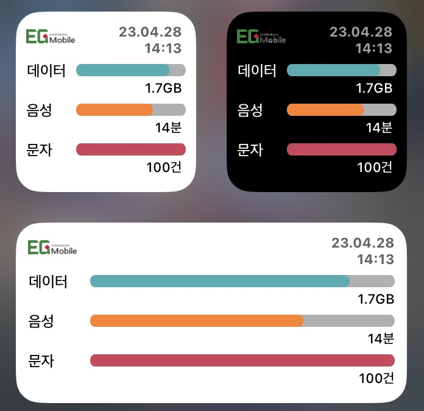

# EGMobile (LGU+) Usage Widget for iOS/iPadOS
이지모바일(코드모바일) LGU+망 통신사 사용량 조회 위젯 (Scriptable)

[위젯 다운로드 (최신)](https://github.com/nerious2/egmobile-lg-usage-widget-for-ios/releases/latest)

[Scriptable 설정 방법](Tutorial.md)

## 소개

- iOS/iPadOS 14 이상을 지원하는 Apple 기기에서 사용 가능한 [Scriptable](https://apps.apple.com/kr/app/scriptable/id1405459188) 위젯입니다.
- [이지모바일](https://www.egmobile.co.kr/) 통신사의 유플러스망을 이용하는 회선에 대한 사용량(데이터, 음성, 문자)을 조회하여 위젯 형태로 표시합니다.
- 이지모바일 KT망 이용자는 [KT 마이알뜰폰](https://apps.apple.com/kr/app/kt-%EB%A7%88%EC%9D%B4%EC%95%8C%EB%9C%B0%ED%8F%B0/id1639287515) 앱을 사용하시기 바랍니다.
- 대표로 설정된 번호 1개에 대해서만 사용량 조회가 가능합니다. 여러 회선을 조회하려면 회선 개수만큼 스크립트 개수를 늘리면 됩니다.
- 과도한 데이터 사용을 막기 위해, 자동으로 새로고침하는 최소 주기(캐시 보관 시간)를 설정할 수 있습니다.
- 다크모드 테마를 지원하며, 다크모드 설정과 상관 없이 테마를 고정할 수도 있습니다.
- 스크립트 설정 메뉴를 지원합니다. **초기 설정을 위해 처음 1회는 반드시 스크립트 파일을 Scriptable 앱 내에서 실행하시기 바랍니다.**

## 유의사항

- **사용량 조회는 실시간 정보가 아니므로 참고용으로만 이용하시기 바랍니다.** 본 위젯을 사용함에 있어 과도한 추가 요금 발생 등의 문제에 대한 책임은 사용자에게 있습니다.
- 자동 새로고침 최소 주기를 짦게 설정할 경우, Wi-Fi가 아닌 환경에서 데이터 사용량이 증가할 수 있습니다. (`설정 - 셀룰러 - 이번 청구 기간`에서 Scriptable 사용량 확인 가능)
- **자동 새로고침 최소 주기는 위젯이 자동으로 새로고침하는 정확한 주기를 설정하는 것이 아닙니다.** 위젯이 새로고침되는 주기는 iOS의 정책에 따라 자동으로 결정됩니다.
- 이지모바일 사용량 조회를 위해 **이름, 생년월일, 전화번호**를 json 파일로 Scriptable Document (iCloud Drive를 사용하는 경우에는 iCloud에 보관됨) 경로에 평문으로 저장합니다. **이름, 생년월일, 전화번호는 egmobile.co.kr 도메인을 제외한 그 어떤 곳에도 사용하지도, 수집하지도 않습니다.** 스크립트가 불필요하여 삭제하고자 하는 경우, 스크립트 설정 메뉴에서 사용자 정보 삭제 기능을 이용하시기 바랍니다.
- 해당 스크립트는 사용자의 설정에 따라 자동으로 스크립트를 업데이트하는 기능을 제공합니다.
