# Scriptable 설정 방법
Scriptable 앱을 통해 위젯을 설정하는 방법에 대해 안내합니다.

아이폰/아이패드에 Scriptable 앱이 설치되어 있어야 합니다.

[Scriptable 앱 설치](https://apps.apple.com/kr/app/scriptable/id1405459188)

## 목차

1. 스크립트 다운로드
2. 스크립트 적용
3. 사용자 정보 입력
4. 스크립트 설정
5. 위젯 설정하는 방법

---

## 1. 스크립트 다운로드
스크립트를 적용하려는 아이폰/아이패드의 인터넷 브라우저 (사파리, 크롬 등)에서 아래 주소로 접속하여 최신 버전의 스크립트를 다운로드합니다.

[스크립트 최신버전 다운로드](https://github.com/nerious2/egmobile-lg-usage-widget-for-ios/releases/latest)

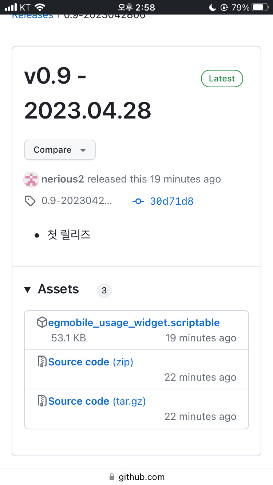

Assets 에서 확장자 scriptable 파일을 다운로드 받습니다.

---

## 2. 스크립트 적용

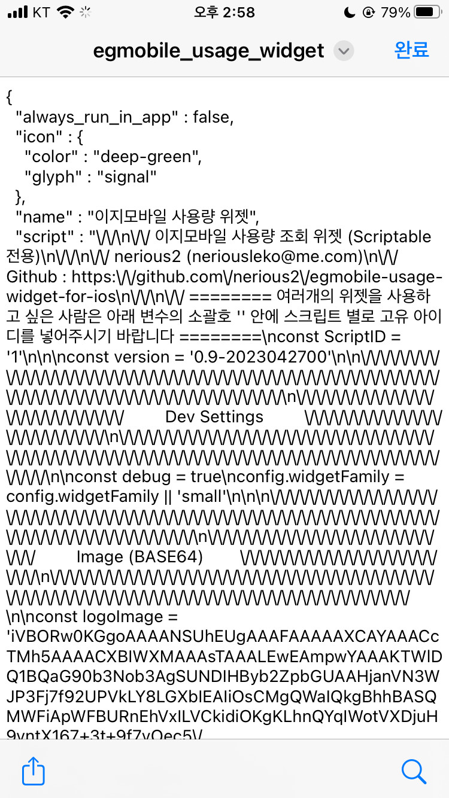

다운로드 받은 스크립트 파일을 열고 좌측 하단의 공유하기 버튼을 선택합니다.

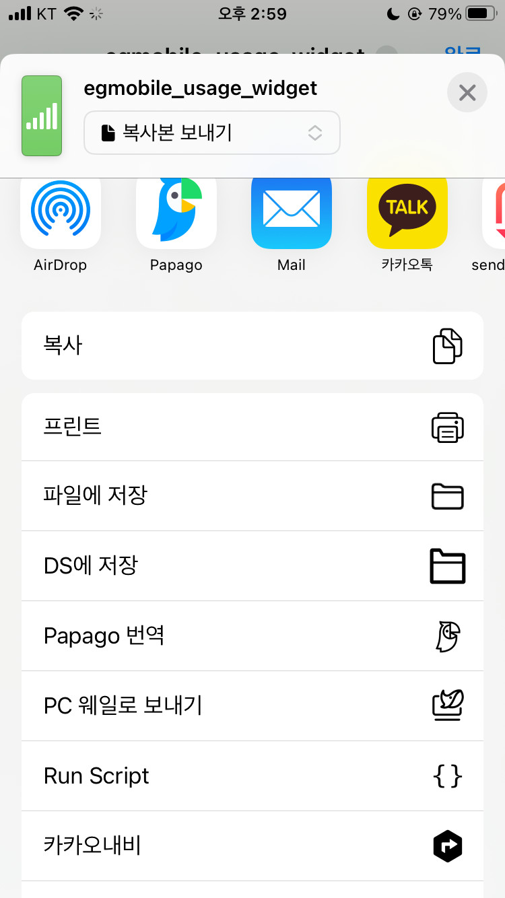

상단의 앱 리스트에서 오른쪽에서 왼쪽으로 스크롤하여, '더 보기'를 선택합니다.

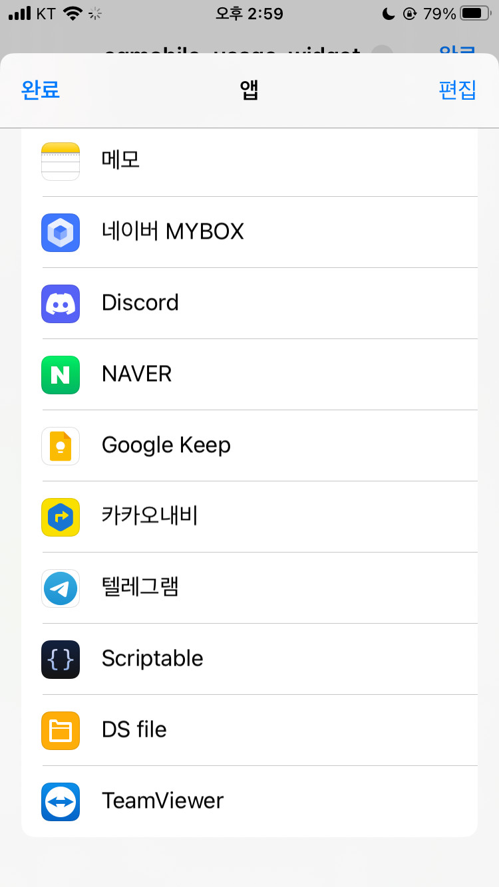

앱 리스트에서 Scriptable을 선택합니다.

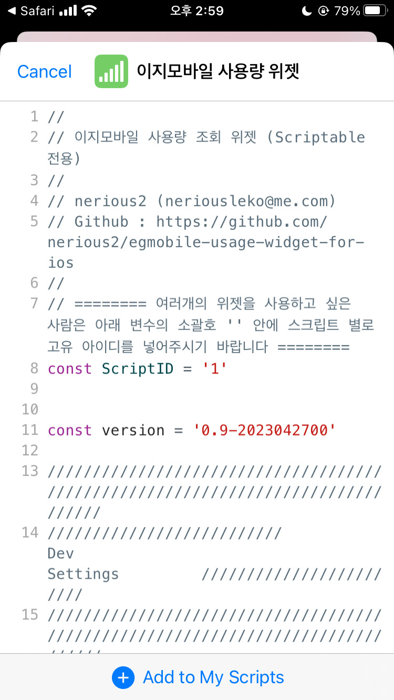

하단의 Add to My Scripts를 선택합니다.

---

## 3. 사용자 정보 입력

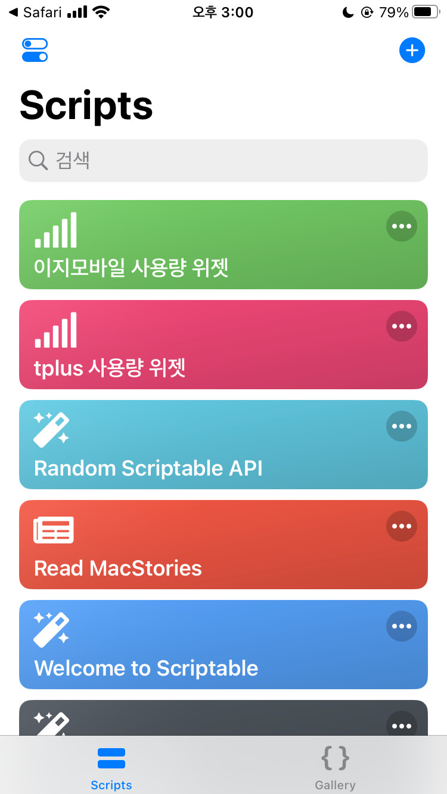

Scriptable 메인 화면에 추가된 스크립트를 눌러 실행합니다.

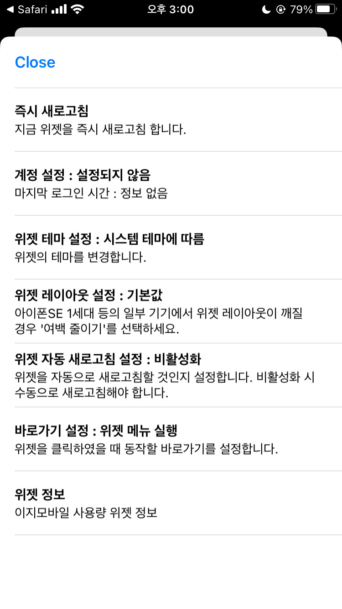

스크립트 메뉴에서 **계정 설정**을 선택합니다.

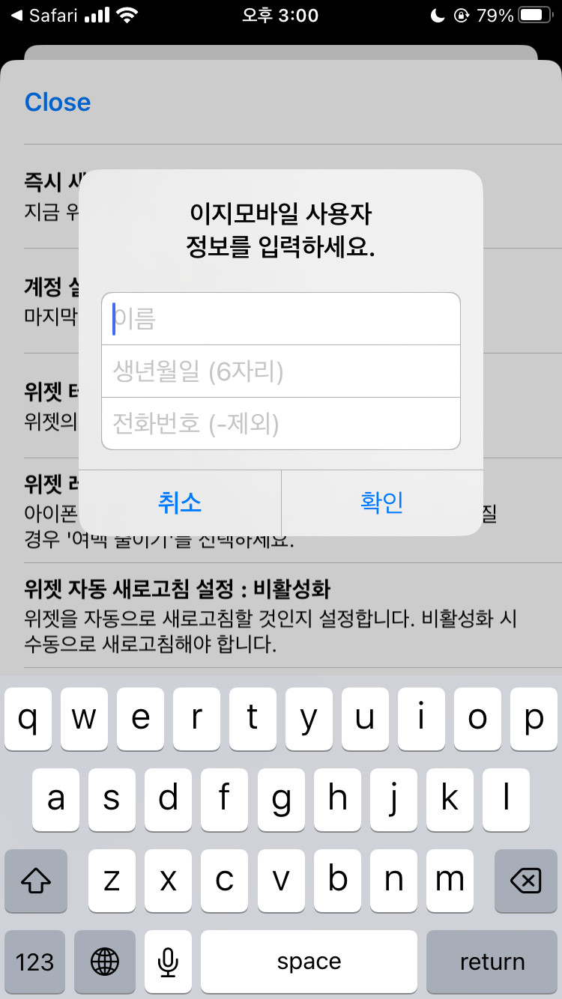

이지모바일 유플러스망에 가입된 회선의 가입자 이름, 생년월일 (6자리), 전화번호 (-를 제외한 11자리)를 입력하고 확인을 선택합니다.

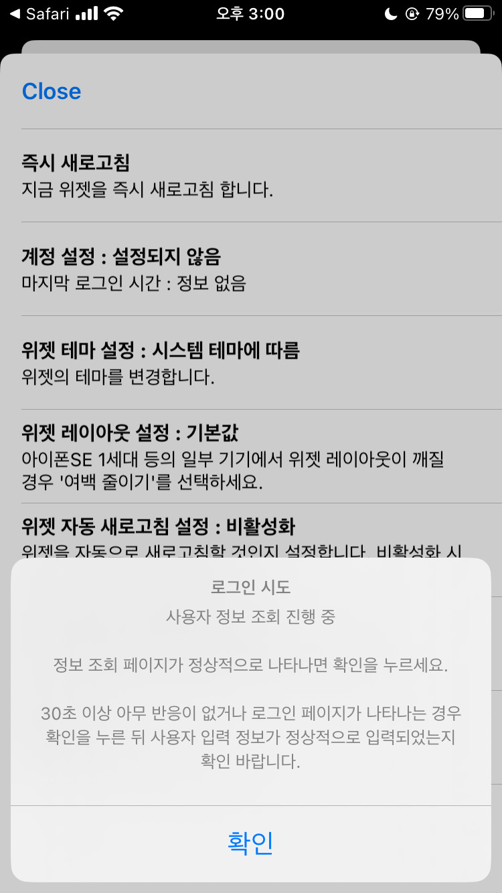

로그인 시도 화면이 나오고 잠시 기다리면 실시간 정보 페이지가 나타납니다.
만약 이 화면에서 30초 이상 기다려도 아무런 반응이 없거나, 사용자 정보 페이지가 아닌, 정보 조회 입력 페이지가 나오면 확인을 누른 뒤, 다시 계정 설정을 눌러 계정 정보를 정확하게 입력해보시기 바랍니다.

**개통 당일에는 조회가 안될 수 있으니 다음날 다시 시도해보시기 바랍니다.**

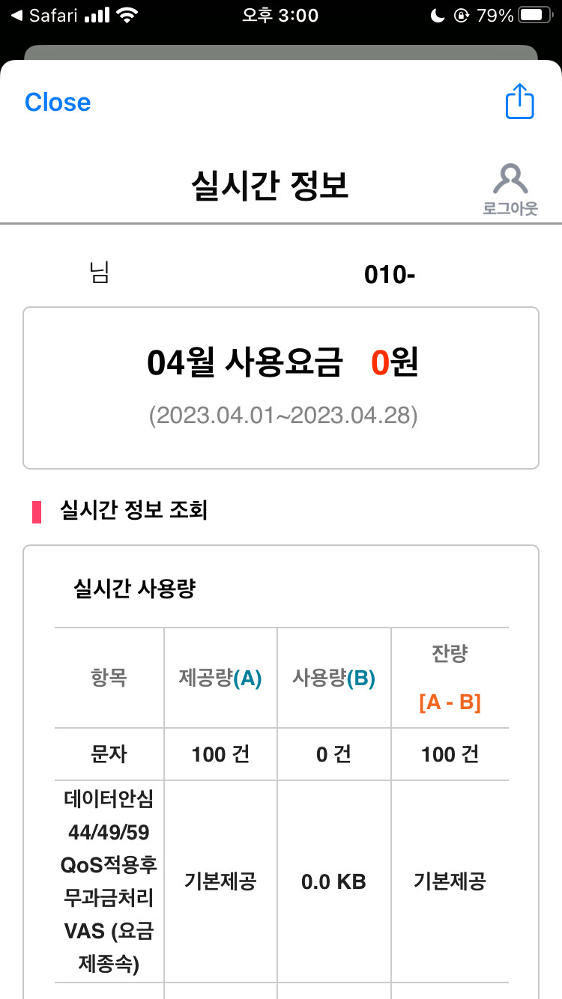

정상적으로 조회가 된 경우 위 화면과 같이 실시간 정보 페이지가 나타납니다.
좌측 상단의 Close를 눌러 창을 끄고, 확인을 눌러 팝업을 종료하세요.

---

## 4. 스크립트 설정

스크립트 메뉴에서 다양한 설정을 진행 할 수 있습니다.

- 즉시 새로고침 : 실시간 정보 페이지를 표시하고, 위젯이 설정되어 있는 경우 위젯을 새로고침 합니다.
- 계정 설정 : 이지모바일 사용량 조회할 회선의 이름, 생년월일, 전화번호를 입력합니다.
- 위젯 테마 설정 : 위젯의 테마를 설정합니다.
- 위젯 레이아웃 설정 : 아이폰SE 1세대의 경우 위젯의 여백이 너무 좁게 나오는 문제가 있습니다. 아이폰SE 1세대는 '여백 줄이기'를 선택하고 사용하시기 바랍니다. 이외의 기종은 기본값으로 두고 사용하세요.
- 위젯 자동 새로고침 설정 : 위젯을 자동으로 새로고침할 것인지 여부를 설정합니다. 비활성화할 경우 스크립트를 실행하여 수동으로 새로고침을 하셔야 합니다.

**자동 새로고침 최소 주기는 위젯이 자동으로 새로고침하는 정확한 주기를 설정하는 것이 아닙니다.** 위젯이 새로고침되는 주기는 iOS의 정책에 따라 자동으로 결정됩니다. 60분으로 설정한 경우, 마지막 새로고침 시간에서 60분 동안은 위젯의 새로고침이 발생하더라도 서버와 통신하지 않는다는 의미입니다.

- 바로가기 설정 : 위젯을 선택한 경우 실행할 동작을 설정합니다.
- 위젯 설정 : 스크립트의 새로운 버전을 자동으로 체크하거나, 수동으로 새 버전이 있는지 확인하여 업데이트가 가능합니다. 기기에 저장된 계정 정보를 삭제할 수 있습니다. **개발자에게 커피를 한잔 사줄 수 있습니다 :D**

---

## 5. 위젯 설정하는 방법

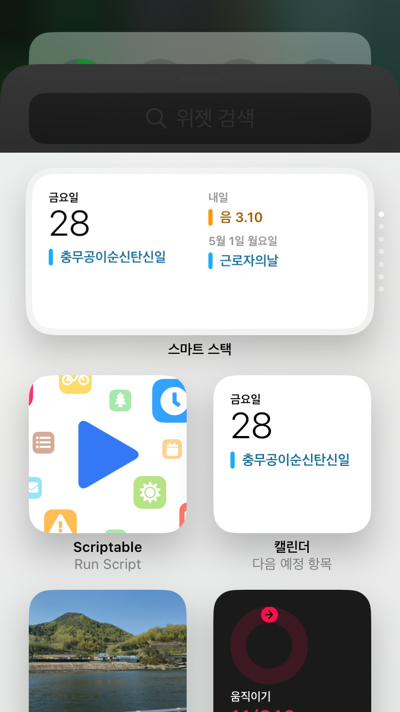

기기의 홈 화면이나 위젯을 모아놓은 화면을 길게 눌러, 편집모드로 들어간 뒤 Scriptable 앱을 선택합니다.

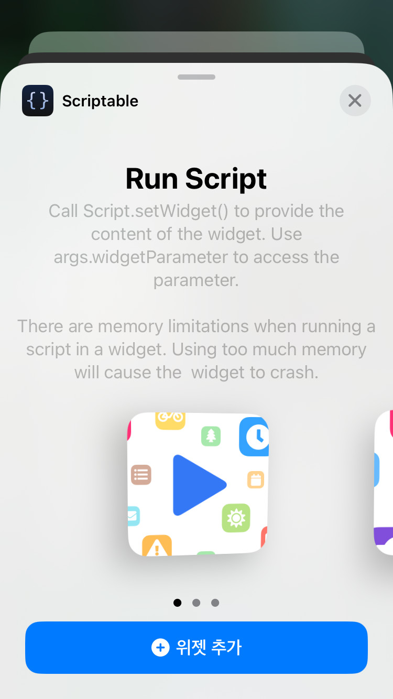

사용자가 원하는 사이즈를 선택하고 '위젯 추가'를 선택합니다.

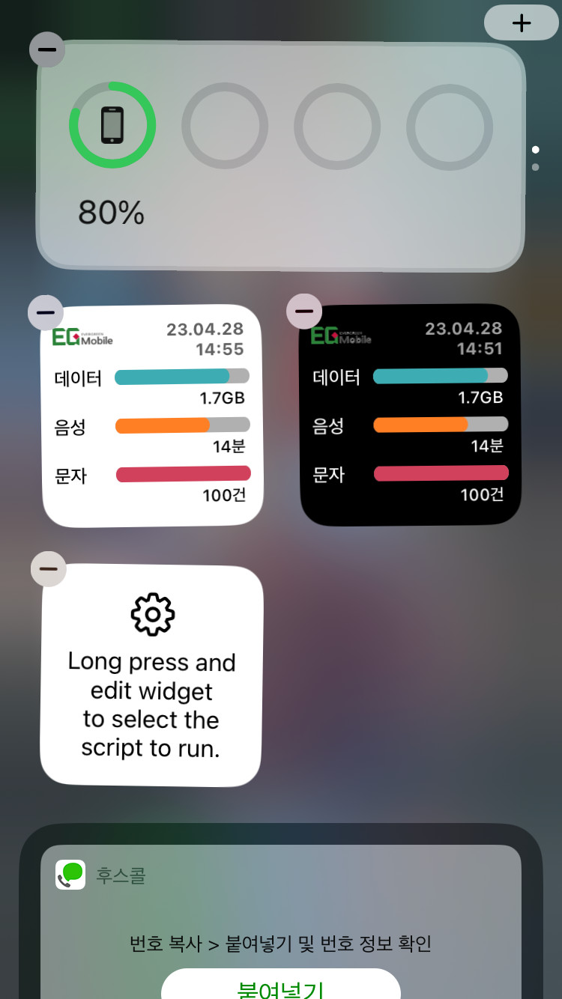

추가된 위젯을 선택하여, 위젯 편집 모드로 진입합니다.

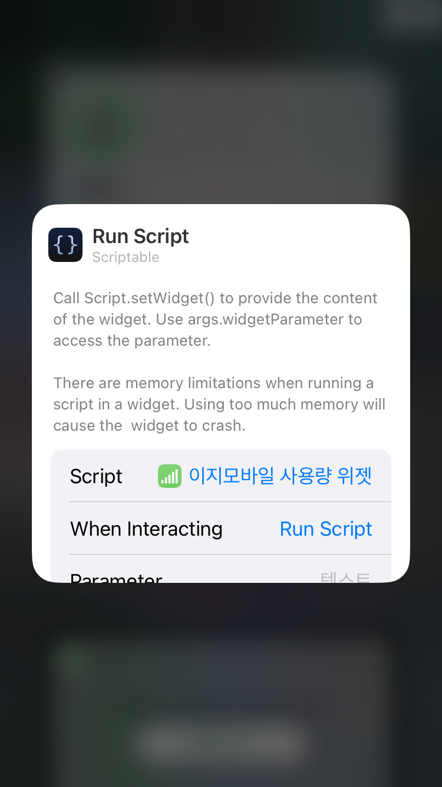

Script 항목을 선택하여 추가한 스크립트를 지정합니다.
When Interacting 은 **Run Script**로 설정하셔야 '바로가기 설정' 에서 지정한 동작을 수행합니다.
